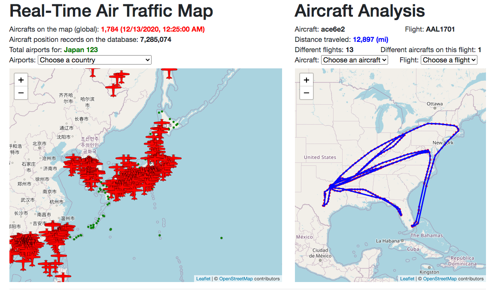
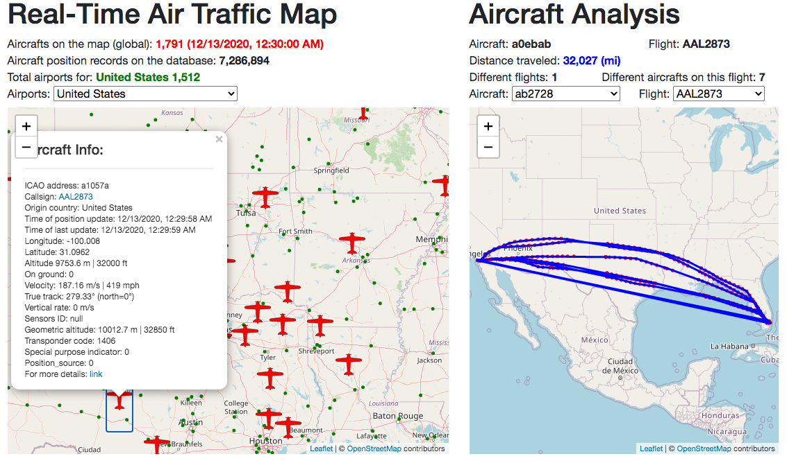
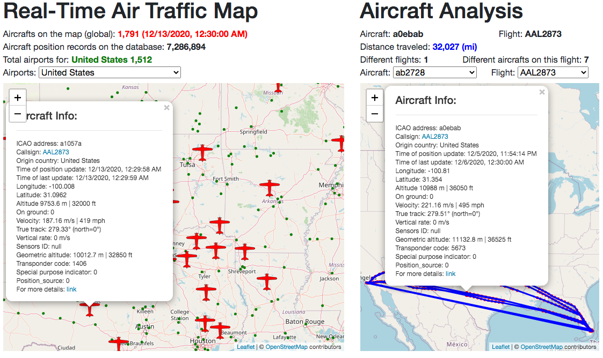
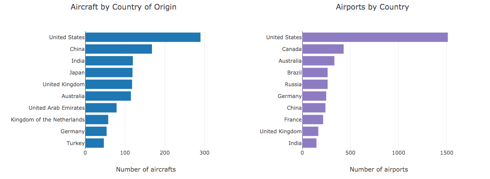
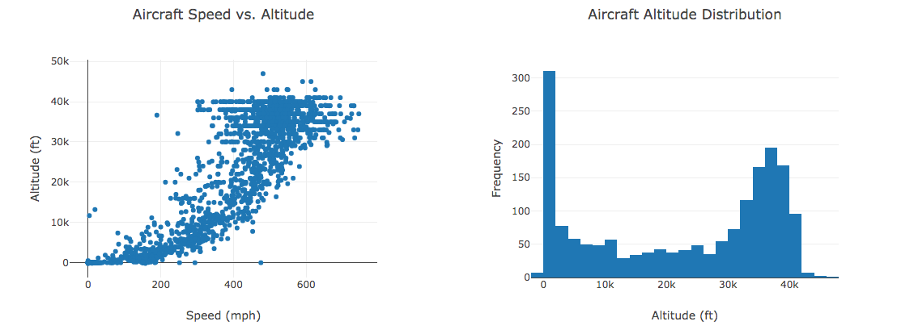
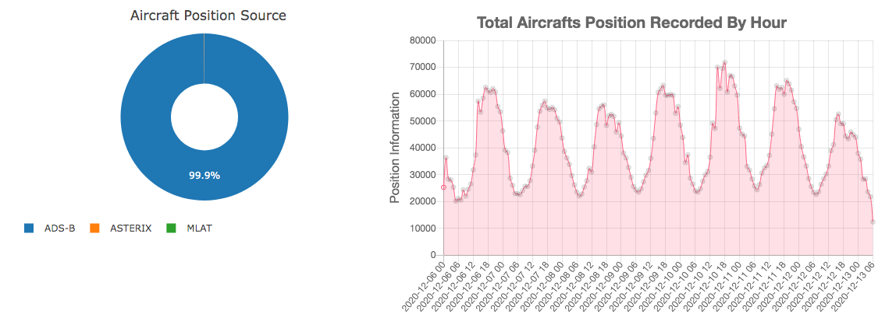

# 18 Project 2: Global Air Traffic Live Tracker

## Rice University Data Analytics and Visualization Boot Camp 2020

This repository contains the following scenario:
 

## Airtraffic Live Dashboard

This project consists of the creation of a web application dashboard that provides real-time information about global air traffic. The main view of the dashboard is the following.

The project was deployed in two versions. A light version using only JavaScript/HTML/CSS that tracks only real-time results that can be accessed [here](https://gpivaro.github.io/Project_2/). The full version of this project has a back-end compose of Python and MySQL and it is available [here](https://airtraffic-live.herokuapp.com/).
 
 ---

### Data Source

The main data source to build our live tracker dashboard is the free API from [The OpenSky Network](https://opensky-network.org/). A short description of the OpenSky Network is the following.

The OpenSky Network [live REST API](https://opensky-network.org/api) provides a JSON object with geolocation info about the aircraft using [Automatic Dependent Surveillance-Broadcast (ADS-B)](https://en.wikipedia.org/wiki/Automatic_Dependent_Surveillance%E2%80%93Broadcast). This project queries the OpenSky Network API every 5 min for the full version of this [dashboard](https://airtraffic-live.herokuapp.com/) and every user access for the [light version](https://airtraffic-live.herokuapp.com/).

Besides the live data described above, this application utilizes airport information based on the data available [here](https://raw.githubusercontent.com/jpatokal/openflights/master/data/airports.dat).

### Dashboard Visualizations

The main functionality of the dashboard is two maps shown at the top of this page. The dashboard is intended to provide means for the user to access several different information as described below.

#### Map view:

Left MAP: The user has access to the number of aircraft currently on the map (global, not only on the selected view) and the time of the last updated information. Below that, the user has access to the total number of aircraft messages that are currently stored on the database. Right below, the user has a dropdown menu to select a Country to be displayed on the map. Once the country is selected, the country name and the total of airports for that country are displayed on the line above. On the map, the user can either select an aircraft or an airport to obtain more information about it.

Right Map: The user has information about one specific aircraft. On the first line, the aircraft's unique ICAO24 address and the current flight are displayed. The next line shows how many miles that aircraft was traveled based on the data available in this application database. The following line displays how many different flights that aircraft was and how many different aircraft were in that flight. Underneath that, the user has two dropdown menus to select an aircraft or a flight to be updated on the map.

On both maps, the user can click either on the aircraft or airport to open a popup to obtain more information about the selected item.

#### Aircraft and Airports by Country

These horizontal bar charts provide information on the top 10 origin countries in terms of the number of aircraft currently on the map (left) and the top 10 countries in terms of the number of airports (right).

#### Altitude and Speed Relationship

The scatter plot on the left shows the relationship between the aircraft's' speed and altitude. On the right, we have a histogram with the number of aircraft by the altitude.

#### Position Source And Live Aircraft Distribution

The doughnut chart on the left shows the aircraft by the source position that was reported on the communication messages. On the right, the chart displays the number of aircraft communication messages that were recorded on this application database by the hour.

---

### How to Install

* [Data base creation](Database): create the database based on the schema files [aircraft_schema](Database/aircraft_schema.sql) and [airport_schema](Database/airport_schema.sql). The notebooks [Database/Airports_Location.ipynb](Airports_Location.ipynb) and [Database/Opensky_API_Data.ipynb](Opensky_API_Data.ipynb) help to understand how the field are created for each table .

* [Query API and update database](scripts): the scripts are used to update the database and query the database based on the database schema. The [MySQL_Add](scripts/MySQL_Add.py ) runs in the machine that is responsible to query [Opensky REST API](https://opensky-network.org/api).

* [Flask web server](app.py) is the main application file. It handles the webserver and executes all the functionalities needed to run this application.

* [HTML](templates) contains the HTML files for the front-end of this application.

* [Javascript](static) contains the JavaScript files that create the front-end of this application.

---

### Expansion Opportunites

There are many air traffic data sources that were found while preparing this dashboard that was not explored. The following list some of the resources that can provide more data points to expand this work. 

* [Openflights.org](https://openflights.org/data.html#airport) - Airport, airline and route data;

* [Airport-data.com](https://www.airport-data.com/) and [Airport-data.com/api](https://www.airport-data.com/api/doc.php) - Extensive Aircraft Data;

* [flyingnut.com](http://www.flyingnut.com/adsbmap/grids/aircraft.html) - ADS-B observations;

* [Adsbexchange](https://www.adsbexchange.com/) - World's largest source of unfiltered flight data; [Adsbexchange aircraft list API](https://public-api.adsbexchange.com/VirtualRadar/AircraftList.json) - Aircraft json data; [ADSBexchange.com API](https://rapidapi.com/adsbx/api/adsbexchange-com1)

* [Virtual Radar Server](http://www.virtualradarserver.co.uk/Documentation/Formats/AircraftList.aspx) - This JSON file reports on the state of all of the aircraft tracked by a receiver or merged feed;

* [Flightaware](https://flightaware.com/live/) - Real-time worldwide flight traffic; [Flightaware](https://flightaware.com/resources/registration/) - Use the registration number (N...) to search for aircraft;

* [avionictools](http://www.avionictools.com/icao.php)  - Convert a US aircraft registration (N Number) to the corresponding ICAO address

#### Next Steps:

* Associate the aircraft with the airports (to/from);

* Track the airport's traffic;

* Add a layer for the weather;

* Add a search field to the user search by aircraft or airport;

* Add stats for individual flights and airports.

